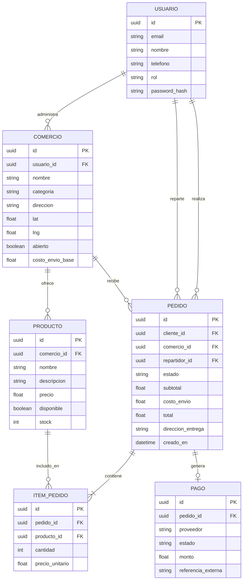

# Diagrama entidad-relación - Pedidos Soto

Este diagrama se renderiza automáticamente al verlo en GitHub (no hace falta ninguna herramienta externa).

## Notas de diseño

- **`rol` en `USUARIO`**: distingue cliente / comercio / repartidor / admin en una sola tabla,
  en vez de tener tablas separadas por tipo de usuario. Más simple para el login y la autenticación.
- **`precio_unitario` en `ITEM_PEDIDO`**: se guarda el precio al momento de la compra, no se
  referencia el precio actual del producto. Si el comercio cambia precios después, no debe
  afectar pedidos ya hechos.
- **`repartidor_id` en `PEDIDO`**: puede ser nulo — el pedido nace sin repartidor asignado y
  se completa cuando alguien lo toma.
- **`PAGO` como tabla separada**: permite trackear el estado del pago (pendiente, aprobado,
  rechazado por Mercado Pago) de forma independiente al estado logístico del pedido
  (en preparación, en camino, entregado).
- **Relación `USUARIO administra COMERCIO`**: asume que cada comercio tiene un único usuario
  dueño/administrador. Si más adelante necesitan que varios usuarios administren el mismo
  comercio, esto pasaría a ser una tabla intermedia (`COMERCIO_ADMINS`).

## Pendiente de discutir con el equipo

- ¿El campo `estado` de `PEDIDO` se guarda como string o conviene una tabla `ESTADOS_PEDIDO`
  aparte con historial de cambios (para poder saber cuánto tardó cada etapa)?
- ¿Necesitan una tabla de `CALIFICACIONES` (cliente califica pedido/repartidor)? No está en este
  primer borrador porque no se mencionó como prioridad.
- ¿`COMERCIO` necesita horarios de atención estructurados (tabla aparte por día) en vez de un
  campo de texto libre?
